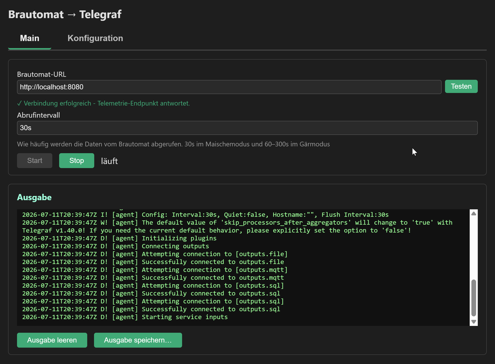
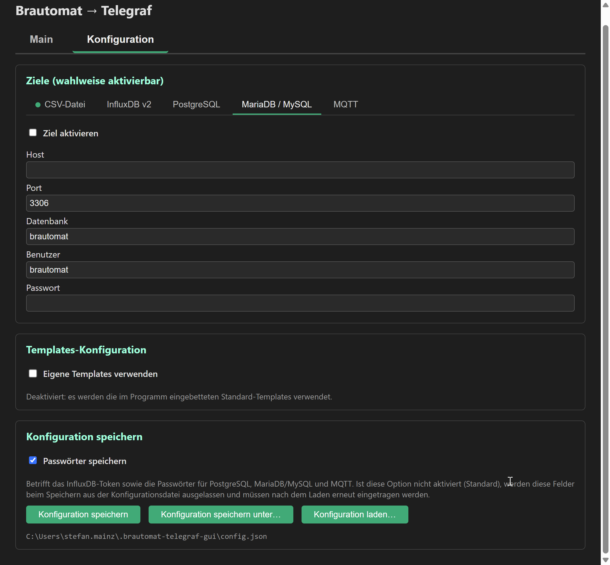

# Brautomat Telegraf Wrapper

Eine Desktop-Anwendung, die Messwerte von einem [**Brautomat**](https://innuendopi.gitbook.io/brautomat32)
abholt und wahlweise per [telegraf](https://www.influxdata.com/time-series-platform/telegraf/) an ein oder mehrere Ziele weiterleitet: CSV-Datei,
InfluxDB v2, PostgreSQL, MariaDB/MySQL und/oder MQTT. Gedacht für alle,
die die Braudaten (Temperaturen, aktueller Modus, aktiver Rastschritt,
Heizleistung ...) dauerhaft protokollieren und z. B. in [Grafana](https://grafana.com)
visualisieren wollen, ohne selbst eine Telegraf-Konfiguration von Hand
schreiben zu müssen.

Läuft unter Linux, macOS und Windows.

## Inhalt

- [Funktionsweise](#funktionsweise)
- [Nutzung](#nutzung)
- [Bauen](#bauen)
- [Entwicklung](#entwicklung)
- [CI/CD (Woodpecker)](#cicd-woodpecker)
- [Sicherheitshinweis zu Zugangsdaten](#sicherheitshinweis-zu-zugangsdaten)

## Funktionsweise

Das Brautomat-Gerät stellt unter `http://<host>/telemetry` per `GET`
einen aktuellen JSON-Messpunkt bereit - Zeitstempel, aktueller Modus
(`idle`, `mash`, `fermenter`, `manual`, `autotune`), aktiver Rastschritt
sowie Ist-/Soll-Temperatur und Heizleistung für Maische-, Sud-, HLT- und
Gärbehälter.

Diese App fragt diese Daten **nicht selbst** ab - das übernimmt
[Telegraf](https://www.influxdata.com/time-series-platform/telegraf/),
InfluxDatas quelloffener Agent zum Sammeln und Weiterleiten von Metriken.
Die App ist ein grafischer Wrapper darum, der Telegraf für diesen
konkreten Anwendungsfall konfigurierbar und bedienbar macht:

1. Im Formular werden Geräte-URL, Abrufintervall und die gewünschten
   Ziele eingetragen (mehrere Ziele lassen sich gleichzeitig aktivieren).
2. Beim Klick auf **"Start"** generiert die App daraus eine vollständige
   Telegraf-Konfiguration: eine `telegraf.conf` (Agent-Einstellungen +
   `inputs.http` gegen `/telemetry`) sowie je aktiviertem Ziel eine
   eigene Datei unter `telegraf.d/` (`outputs.file`, `outputs.influxdb_v2`,
   `outputs.sql` für Postgres/MySQL, `outputs.mqtt`). Grundlage dafür
   sind Textvorlagen (Templates), die entweder fest in die App eingebaut
   sind oder durch eigene ersetzt werden können (siehe
   [Templates](#templates-eingebettet-vs-benutzerdefiniert)).
3. Die App startet `telegraf` als Kindprozess mit genau dieser
   Konfiguration. Ab dann läuft Telegraf selbstständig: Es fragt
   `/telemetry` im eingestellten Intervall ab und schreibt jeden
   Messpunkt in alle aktivierten Ziele.
4. Die Ausgabe von Telegraf wird live im Log-Fenster der App angezeigt.
   **"Stop"** beendet den Telegraf-Prozess wieder sauber.

Die App selbst enthält also keine eigene Logik zum Schreiben nach
CSV/InfluxDB/Postgres/MySQL/MQTT - diese Arbeit macht Telegraf anhand der
generierten Konfiguration. Das hält die App klein und nutzt die
ausgereiften, bereits vorhandenen Telegraf-Output-Plugins.

## Nutzung

### Oberfläche

Die GUI ist in zwei Tabs aufgeteilt.

**Main** - für den laufenden Betrieb:

- Geräte-URL und Abrufintervall.
- **"Testen"**: führt einen echten Request gegen
  `<Geräte-URL>/telemetry` aus. Erfolg wird direkt unter dem Feld grün
  bestätigt; schlägt der Test fehl (Gerät nicht erreichbar, falscher
  Status-Code, ungültiges JSON o. ä.), öffnet sich ein Pop-up mit der
  genauen Fehlerursache.
- **Start** / **Stop** für den Telegraf-Prozess.
- Ausgabefenster mit der Live-Ausgabe von Telegraf, darunter
  **"Ausgabe leeren"** und **"Ausgabe speichern…"** (schreibt den
  aktuellen Inhalt über einen nativen Dateidialog als Textdatei).



**Konfiguration** - seltener benötigte Einstellungen, in dieser Reihenfolge:

1. **Ziele** - ein Unter-Tab pro Ziel (CSV-Datei, InfluxDB v2,
   PostgreSQL, MariaDB/MySQL, MQTT), jeweils mit eigener
   "Ziel aktivieren"-Checkbox. Mehrere Ziele können gleichzeitig aktiv
   sein, unabhängig davon, welcher Unter-Tab gerade sichtbar ist.
2. **Templates-Konfiguration** - dazu mehr im Abschnitt
   [Templates](#templates-eingebettet-vs-benutzerdefiniert).
3. **Konfiguration speichern** - dazu mehr im Abschnitt
   [Konfiguration speichern/laden](#konfiguration-speichernladen).

   

### Konfiguration speichern/laden

Das komplette Formular kann als JSON gespeichert und wieder geladen
werden:

- **Konfiguration speichern**: schreibt unter den zuletzt verwendeten
  Pfad (beim allerersten Mal der effektive Standardpfad, siehe unten).
- **Konfiguration speichern unter…**: öffnet einen nativen Dateidialog
  für einen beliebigen Pfad.
- **Konfiguration laden…**: öffnet einen nativen Dateidialog zum Öffnen
  einer bestehenden `config.json`.

Beim Programmstart wird automatisch versucht, die Konfiguration vom
effektiven Standardpfad zu laden; existiert dort keine Datei, startet
die App einfach mit den Vorbelegungen (kein Fehler).

Der **effektive Standardpfad** ergibt sich in dieser Reihenfolge:

1. `--config <pfad>` beim Programmstart, falls gesetzt
2. sonst plattformübergreifend `~/.brautomat-telegraf-gui/config.json`
   (unter Windows entsprechend
   `%USERPROFILE%\.brautomat-telegraf-gui\config.json`)

```
./brautomat-telegraf-gui --config /pfad/zu/meiner/config.json
```

Das ist z. B. nützlich, um mehrere Geräte/Profile mit unterschiedlichen
Konfigurationsdateien zu betreiben, ohne jedes Mal manuell "Laden…"
anklicken zu müssen.

**Passwörter speichern:** Checkbox, standardmäßig **nicht** angehakt.
Ist sie deaktiviert, werden InfluxDB-Token sowie die Passwörter für
PostgreSQL, MariaDB/MySQL und MQTT beim Speichern aus der
Konfigurationsdatei ausgelassen und müssen nach dem Laden erneut
eingetragen werden. Ist sie aktiviert, landen alle Zugangsdaten im
Klartext in der gespeicherten Datei (siehe
[Sicherheitshinweis](#sicherheitshinweis-zu-zugangsdaten)).

### Feldnamen und CSV-Header

Das Gerät liefert seine Messwerte mit kurzen JSON-Feldnamen (`m`, `mt`,
`mp`, `s`, `st`, `sp`, `h`, `ht`, `hp`, `f`, `ft`). Bevor die Werte an
ein Ziel weitergereicht werden, benennt ein globaler
`processors.rename`-Schritt (siehe `processors-rename.conf.tmpl`) diese
in sprechende Namen um - das gilt für **alle** aktivierten Ziele
gleichermaßen:

| Kurzname | Sprechender Name |
|---|---|
| `m` | `mash_temperature` |
| `mt` | `mash_target_temperature` |
| `mp` | `mash_power_percent` |
| `s` | `boil_kettle_temperature` |
| `st` | `boil_kettle_target_temperature` |
| `sp` | `boil_kettle_power_percent` |
| `h` | `hlt_temperature` |
| `ht` | `hlt_target_temperature` |
| `hp` | `hlt_power_percent` |
| `f` | `fermenter_temperature` |
| `ft` | `fermenter_target_temperature` |

Der Zeitstempel (`t`) taucht hier bewusst nicht auf: Er wird bereits
vorher über `json_time_key = "t"` als Zeitstempel der Metrik selbst
verwendet und existiert danach nicht mehr als eigenständiges Feld. Bei
CSV erscheint er stattdessen als eigene `timestamp`-Spalte (siehe
unten).

**CSV-Header:** Die CSV-Datei bekommt beim Start eine feste
Spaltenreihenfolge über `csv_columns` im CSV-Template (statt telegrafs
Standard-Sortierung). Bevor telegraf gestartet wird, prüft die App, ob
die Zieldatei fehlt oder leer ist (Größe 0) - falls ja, schreibt sie
selbst die passende Kopfzeile:

```
timestamp,mode,stepName,mash_temperature,mash_target_temperature,mash_power_percent,boil_kettle_temperature,boil_kettle_target_temperature,boil_kettle_power_percent,hlt_temperature,hlt_target_temperature,hlt_power_percent,fermenter_temperature,fermenter_target_temperature
```

telegraf selbst schreibt bewusst keinen Header (`csv_header = false`),
da es diesen sonst bei jedem Flush erneut in die Datei einfügen würde.
Existiert die Datei bereits mit Inhalt, wird nichts verändert - so
bleibt eine laufend erweiterte CSV-Datei über Neustarts hinweg intakt.

**Bei eigenen Templates (`--templates-dir`) zu beachten:** Die
Spaltenliste für den vorab geschriebenen Header ist in
`internal/config/csv_header.go` hinterlegt und muss manuell mit einem
eigenen `outputs-csv.conf.tmpl` synchron gehalten werden, falls dort
eine andere Spaltenreihenfolge definiert wird.

### Telegraf-Executable

Im Panel "Telegraf-Executable" (oberster Bereich im Tab "Konfiguration")
lässt sich festlegen, welche telegraf-Binary verwendet wird:

- **Leer:** automatische Erkennung - zuerst `bin/` neben der eigenen
  Programm-Datei, sonst `telegraf`/`telegraf.exe` im PATH.
- **Pfad eingetragen** (per Hand oder über **"Durchsuchen…"**, einen
  nativen Datei-Dialog): wird direkt verwendet.
- **"telegraf herunterladen…"**: fragt zunächst per nativem
  Verzeichnis-Dialog nach einem Zielverzeichnis (Vorschlag:
  `~/.brautomat-telegraf-gui/telegraf/`, kann aber beliebig geändert
  werden), lädt danach die passende telegraf-Version für das aktuell
  laufende Betriebssystem von `dl.influxdata.com` herunter und trägt den
  gefundenen Pfad zur Executable automatisch in das Feld ein. Das Layout
  der offiziellen Release-Archive unterscheidet sich zwischen Windows
  und Linux/macOS - das übernimmt die App automatisch per
  Verzeichnis-Suche.

  Während des Downloads erscheint ein Fortschrittsfenster mit
  Zwischenzuständen ("Lade herunter…", "Entpacke Archiv…", "Suche
  telegraf-Executable…") sowie einem Fortschrittsbalken (zeigt
  Byte-Fortschritt/Prozent, sofern der Server eine Content-Length
  liefert - sonst läuft der Balken unbestimmt weiter).

Der Pfad ist Teil der Konfiguration (`telegrafPath`-Feld) und wird beim
Speichern/Laden mit berücksichtigt.

**Log-Level von telegraf:** Im selben Panel legt ein Dropdown fest, wie
ausführlich telegraf selbst ins Ausgabefenster schreibt - "Quiet" (nur
Fehler), "Normal" (Standard) oder "Debug" (ausführlich, hilfreich zur
Fehlersuche). telegraf kennt dafür kein einzelnes "Level"-Feld, sondern
die beiden `[agent]`-Einstellungen `debug`/`quiet`, auf die
`telegraf.conf.tmpl` die Auswahl abbildet. Nicht zu verwechseln mit dem
`--log-level`-CLI-Flag dieser App (siehe unten) - das betrifft nur Wails'
eigene Konsolenausgabe, nicht telegraf.

### Templates: eingebettet vs. benutzerdefiniert

Die Telegraf-Konfiguration wird aus Textvorlagen gerendert, die
standardmäßig fest in die App eingebaut sind - man braucht also keine
weiteren Dateien, um loszulegen.

Im Panel "Templates-Konfiguration":

- Checkbox **"Eigene Templates verwenden"** deaktiviert (Standard): es
  werden immer die eingebauten Standard-Templates verwendet.
- Aktiviert: ein Pfadfeld, ein **"Durchsuchen…"**- und ein
  **"Templates exportieren…"**-Button werden eingeblendet. Das
  angegebene Verzeichnis wird stattdessen verwendet.
- **"Templates exportieren…"** kopiert die eingebauten
  Standard-Templates unverändert in ein wählbares Verzeichnis - ein
  bequemer Ausgangspunkt, um eigene Anpassungen vorzunehmen (z. B. ein
  anderes Datenbankschema oder zusätzliche Tags), statt bei Null
  anzufangen.
- Der gewählte Pfad ist Teil der Konfiguration und wird beim Speichern/
  Laden mit berücksichtigt.

Ein eigenes Verzeichnis muss folgende Dateien enthalten:

- `telegraf.conf.tmpl`
- `processors-rename.conf.tmpl`
- `outputs-csv.conf.tmpl`
- `processors-rename.conf.tmpl`
- `outputs-influxdb.conf.tmpl`
- `outputs-postgres.conf.tmpl`
- `outputs-mysql.conf.tmpl`
- `outputs-mqtt.conf.tmpl`

Die Templates sind normale Go-`text/template`-Dateien mit Zugriff auf
alle Werte aus dem Formular (z. B. `{{.DeviceURL}}`,
`{{.InfluxDB.Bucket}}`, `{{.Postgres.Password}}`).

### Kommandozeilen-Flags

Vollständige, aktuelle Liste jederzeit per `--help` abrufbar - derselbe
Hilfetext erscheint auch automatisch bei einem ungültigen oder
unbekannten Flag/Argument. Kurzüberblick:

| Flag | Zweck |
|---|---|
| `--config <pfad>` | Pfad zur Konfigurationsdatei (siehe oben) |
| `--templates-dir <pfad>` | Startwert für eigene Templates (in der GUI danach änderbar) |
| `--export-templates <pfad>` | exportiert die eingebauten Templates und beendet sich, **ohne** die GUI zu starten |
| `--start-headless` | startet telegraf direkt mit der geladenen Konfiguration, **ohne** GUI (siehe unten) |
| `--log-level <level>` | Log-Level für Wails-eigene Konsolenmeldungen: `trace`, `debug`, `info` (Standard), `warning`, `error` |
| `--help` / `-h` | zeigt den Hilfetext |

### Headless-Modus (ohne GUI)

```
./brautomat-telegraf-gui --start-headless
```

Liest die Konfiguration mit derselben Priorität wie beim normalen
GUI-Start und startet telegraf sofort damit - **ohne** dass ein Fenster
erscheint. Die Telegraf-Ausgabe landet direkt auf stdout. Das Programm
läuft im Vordergrund, bis es mit **Ctrl+C** beendet wird; dabei wird
telegraf sauber gestoppt, bevor sich das Programm beendet.

Gedacht z. B. für den Betrieb auf einem Server/Raspberry Pi ohne
Desktop-Umgebung, oder um die aktuell gespeicherte Konfiguration ohne
GUI-Interaktion zu starten (etwa aus einem eigenen
Systemd-Unit/Autostart-Skript heraus). Kombinierbar mit `--config` und
`--templates-dir`:

```
./brautomat-telegraf-gui --start-headless --config /pfad/zu/meiner/config.json
```

**Zu Passwörtern:** Wurden beim letzten Speichern keine Passwörter mit
gespeichert (Checkbox "Passwörter speichern" war aus), enthält die
geladene Konfiguration für die entsprechenden Ziele leere Passwortfelder
- telegraf startet dann mit diesen leeren Werten. Ein spezielles
Verhalten für diesen Fall (z. B. Abbruch mit Fehlermeldung, interaktive
Passwortabfrage) ist aktuell noch nicht vorgesehen.

## Bauen

Voraussetzungen: Go 1.25+, Node ist **nicht** nötig (kein JS-Build-Schritt,
das Frontend besteht aus reinem HTML/JS/CSS), sowie die Wails-CLI:

```
go install github.com/wailsapp/wails/v2/cmd/wails@v2.13.0
```

Danach pro Zielplattform:

```
go mod tidy
wails build
```

Für Windows/macOS/Linux jeweils auf der Zielplattform bauen (oder mit
Wails' Cross-Compile-Unterstützung, siehe Wails-Dokumentation), und
vorher die passende Telegraf-Binary in `bin/` legen (siehe
`bin/README.md`). Offizielle Downloads:
https://www.influxdata.com/downloads/

## Entwicklung

### Projektstruktur

```
brautomat-telegraf-gui/
├── go.mod
├── main.go                          # Einstiegspunkt, Flag-Parsing, embed der Frontend-Assets
├── app.go                           # An das Frontend gebundene Methoden (Start/Stop/Speichern/Testen/...)
├── wails.json                       # Wails-Projektkonfiguration
├── .woodpecker/
│   ├── build.yaml                   # CI: Build-Check für Linux/Windows/macOS bei jedem Push
│   └── release.yaml                 # CI: Release inkl. telegraf-Bundle bei Tag-Push, Upload nach Forgejo
├── internal/
│   ├── config/
│   │   ├── config.go                # Config-Struct (Formularmodell)
│   │   ├── templates.go             # //go:embed + GetTemplatesFS (Default vs. --templates-dir)
│   │   ├── generator.go             # Rendert Templates -> telegraf.conf / telegraf.d/*.conf
│   │   ├── csv_header.go            # Schreibt die CSV-Kopfzeile einmalig, bevor telegraf startet
│   │   ├── persistence.go           # Speichern/Laden der Config als JSON, Default-Pfad im Home-Verzeichnis
│   │   └── templates/               # Eingebettete Standard-Templates
│   │       ├── telegraf.conf.tmpl
│   │       ├── processors-rename.conf.tmpl
│   │       ├── outputs-csv.conf.tmpl
│   │       ├── outputs-influxdb.conf.tmpl
│   │       ├── outputs-postgres.conf.tmpl
│   │       ├── outputs-mysql.conf.tmpl
│   │       └── outputs-mqtt.conf.tmpl
│   └── process/
│       ├── runner.go                # Start/Stop/Log-Streaming (plattformneutraler Teil)
│       ├── process_unix.go          # SIGTERM/SIGKILL, Prozessgruppen (Linux/macOS)
│       └── process_windows.go       # Kill() (Windows)
├── internal/telegraf/
│   └── telegraf.go                  # Download/Entpacken (zip/tar.gz) + Suche der telegraf-Executable
├── frontend/
│   ├── index.html                   # Formular in zwei Top-Level-Tabs ("Main"/"Konfiguration") + Log-Fenster
│   └── src/
│       ├── main.js                  # Formular auslesen, Start/Stop, Speichern/Laden, Testen, Events anzeigen
│       ├── tabs.js                  # Reine UI-Logik: Top-Level-Tabs + Ziele-Unter-Tabs
│       └── style.css
├── bin/                              # Hier die telegraf-Binary pro Zielplattform ablegen
├── docker-compose.yml                # Lokale MQTT/Postgres/MariaDB-Testinstanzen (siehe Entwicklung)
└── tools/
    └── mock-server/
        └── main.go                   # Eigenständiger Mock für /telemetry (Entwicklung ohne echtes Gerät)
```

### Feldnamen und CSV-Header

Das Gerät liefert seine Messwerte mit kurzen JSON-Feldnamen (`m`, `mt`,
`mp`, `s`, `st`, `sp`, `h`, `ht`, `hp`, `f`, `ft`). Bevor die Werte an
ein Ziel weitergereicht werden, benennt ein globaler
`processors.rename`-Schritt (siehe `processors-rename.conf.tmpl`) diese
in sprechende Namen um - das gilt für **alle** aktivierten Ziele
gleichermaßen:

| Kurzname | Sprechender Name |
|---|---|
| `m` | `mash_temperature` |
| `mt` | `mash_target_temperature` |
| `mp` | `mash_power_percent` |
| `s` | `boil_kettle_temperature` |
| `st` | `boil_kettle_target_temperature` |
| `sp` | `boil_kettle_power_percent` |
| `h` | `hlt_temperature` |
| `ht` | `hlt_target_temperature` |
| `hp` | `hlt_power_percent` |
| `f` | `fermenter_temperature` |
| `ft` | `fermenter_target_temperature` |

Der Zeitstempel (`t`) taucht hier bewusst nicht auf: Er wird bereits
vorher über `json_time_key = "t"` als Zeitstempel der Metrik selbst
verwendet und existiert danach nicht mehr als eigenständiges Feld. Bei
CSV erscheint er stattdessen als eigene `timestamp`-Spalte (siehe
unten).

**CSV-Header:** Die CSV-Datei bekommt beim Start eine feste
Spaltenreihenfolge über `csv_columns` im CSV-Template (statt telegrafs
Standard-Sortierung). Bevor telegraf gestartet wird, prüft die App, ob
die Zieldatei fehlt oder leer ist (Größe 0) - falls ja, schreibt sie
selbst die passende Kopfzeile:

```
timestamp,mode,stepName,mash_temperature,mash_target_temperature,mash_power_percent,boil_kettle_temperature,boil_kettle_target_temperature,boil_kettle_power_percent,hlt_temperature,hlt_target_temperature,hlt_power_percent,fermenter_temperature,fermenter_target_temperature
```

telegraf selbst schreibt bewusst keinen Header (`csv_header = false`),
da es diesen sonst bei jedem Flush erneut in die Datei einfügen würde.
Existiert die Datei bereits mit Inhalt, wird nichts verändert - so
bleibt eine laufend erweiterte CSV-Datei über Neustarts hinweg intakt.

**Bei eigenen Templates (`--templates-dir`) zu beachten:** Die
Spaltenliste für den vorab geschriebenen Header ist in
`internal/config/csv_header.go` hinterlegt und muss manuell mit einem
eigenen `outputs-csv.conf.tmpl` synchron gehalten werden, falls dort
eine andere Spaltenreihenfolge definiert wird.

### Live-Reload

```
wails dev
```

### Test-Datenbanken / MQTT-Server (Postgres/MariaDB/Mosqitto)

`docker-compose.yml` im Projekt-Root startet lokale Postgres- und
MariaDB-Instanzen sowie einen MQTT-Server zum Testen der entsprechenden
Ziele, mit auf den Hostrechner exponierten Standardports (5432 und 3306
bzw. 1883 für den MQTT-Server) und Daten in anonymen Volumes:

```
docker compose up -d
```

Datenbank und Benutzer heißen jeweils `brautomat` (Passwort `brautomat`)

- das entspricht den Vorbelegungen im PostgreSQL-/MySQL-Tab der GUI, es
muss dort also nur noch das Passwort (`brautomat`) eingetragen werden.

- Der MQTT-Server erfordert keine Authentifizierung. Benutzer und Paswort 
  leer lassen

```
docker compose down             # Container stoppen, Daten bleiben erhalten
docker compose down --volumes   # Container stoppen und Daten löschen
```

### Mock-Server für die Entwicklung

Unter `tools/mock-server` liegt ein eigenständiger, minimaler Ersatz für
ein echtes Brautomat-Gerät - praktisch, um die App zu entwickeln oder zu
testen, ohne dass ein echtes Gerät im Netz erreichbar sein muss. Er
beantwortet `GET /telemetry` mit demselben JSON-Format wie das echte
Gerät: einem hochzählenden Zeitstempel und Werten, die sich von Aufruf zu
Aufruf sichtbar verändern (Modus- und Rastschritt-Wechsel alle paar
Ticks, Temperaturen nähern sich langsam mit etwas Rauschen ihrem
jeweiligen Zielwert an). Die genaue Simulationslogik ist dabei bewusst
simpel und nicht als realistisches Brauprofil gedacht.

Start:

```
go run ./tools/mock-server
```

Optional ein anderer Port/Adresse:

```
go run ./tools/mock-server --addr :9090
```

Danach in der GUI als Geräte-URL `http://localhost:8080` (bzw. den
gewählten Port) eintragen und mit "Testen" prüfen. Läuft komplett
unabhängig von der Wails-App - kein `wails build`/`wails dev` nötig, nur
`go run`.

### Tests

Es gibt aktuell keine automatisierten Tests. `internal/config`
(Template-Rendering) ist reines Go ohne Wails-Abhängigkeit und lässt
sich problemlos mit `go test` isoliert testen - das wäre der
sinnvollste Einstiegspunkt für künftige Tests.

## CI/CD (Woodpecker)

Unter `.woodpecker/` liegen zwei Pipelines für [Woodpecker CI](https://woodpecker-ci.org/):

- **`build.yaml`**: läuft bei jedem Push, baut die App für Linux amd64,
  und Windows amd64 als reine "baut es noch?"-Prüfung. Lädt
  kein telegraf herunter und veröffentlicht nichts.
- **`release.yaml`**: läuft nur bei einem Tag-Push (der Tag-Name ist die
  Versionsnummer) auf dem Banch `main`, baut für dieselben Plattformen, packt
  ein Archiv pro Plattform und veröffentlicht diese als Release-Assets auf
  `git.mainz.ws` (Forgejo).

## Sicherheitshinweis zu Zugangsdaten

Erste Absicherung: die "Passwörter speichern"-Checkbox (Default: aus) -
solange sie nicht aktiviert wird, landen InfluxDB-Token und DB-Passwörter
gar nicht erst in der persistierten `config.json` (siehe
[Konfiguration speichern/laden](#konfiguration-speichernladen)).

Aktiviert der Benutzer diese Option dennoch, werden die Zugangsdaten
direkt in die generierte `telegraf.d/outputs-*.conf` im temporären
Arbeitsverzeichnis (wird beim Beenden der App wieder gelöscht) sowie in
die persistierte `config.json` (Dateirechte `0600`, nur Besitzer
lesbar/schreibbar) geschrieben. Für produktiven Einsatz empfiehlt es
sich zusätzlich:

- die Dateirechte des Arbeitsverzeichnisses einzuschränken,
- optional einen Telegraf-Secret-Store (`secretstores.file` /
  `secretstores.os`) statt Klartext-Werten in den Templates zu nutzen,
- bzw. "Passwort merken" im Formular über die OS-Keychain zu realisieren
  (z. B. via `github.com/zalando/go-keyring`), statt Passwörter dauerhaft
  auf der Platte zu speichern.
